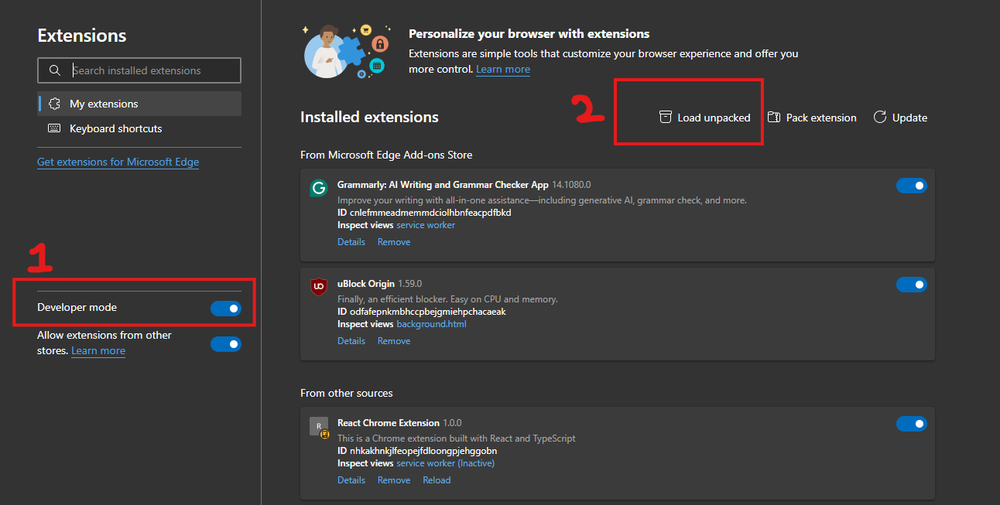

# AI Summarize Extension for Google Chrome

> Also works with Microsoft Edge, Arc Browser, or any **Chromium** based browser
- [AI Summarize Extension for Google Chrome](#ai-summarize-extension-for-google-chrome)
- [How to use?](#how-to-use)

# How to use?
1. Build the Project using `npm install` and then `npm build`
2. First, Load the extension using `chrome://extensions`
3. Next, toggle `Developer Mode` and select load unpacked
   
 
1. Select the `dist` folder.

> **!!Note!!**
> 
> I have configured the extension to work only while using substack articles. If you want to enable the extension globally for any website, replace the website in `"host_permissions"` and `"content_scripts.matches"` with `"<all_urls>"`. Also, make sure to replace the `xpath` in `src/content.ts` to `/html/body`
> 